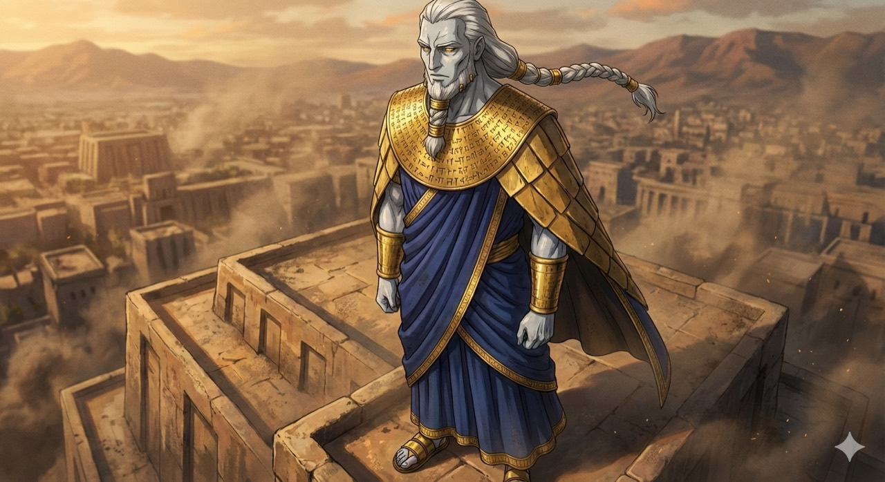
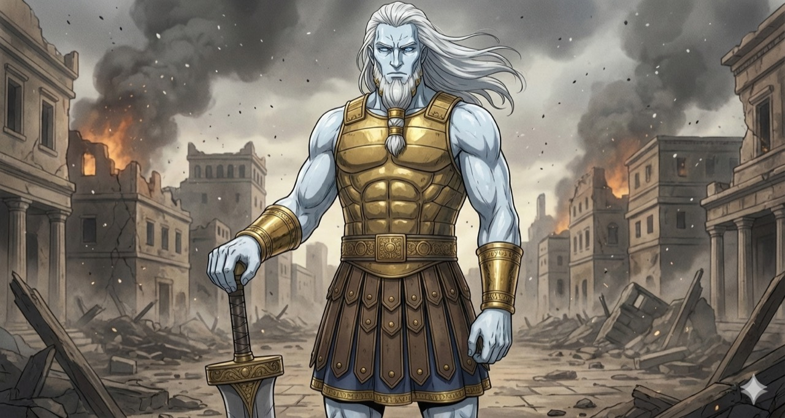
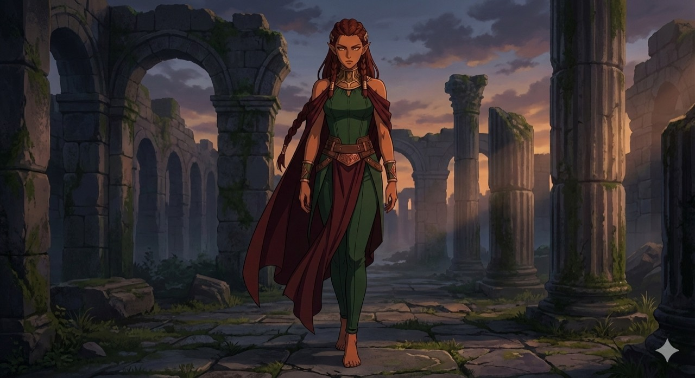
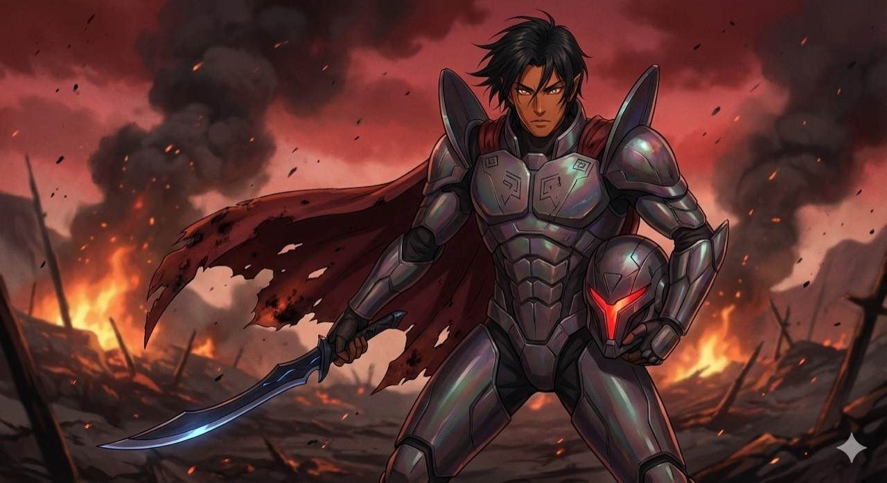
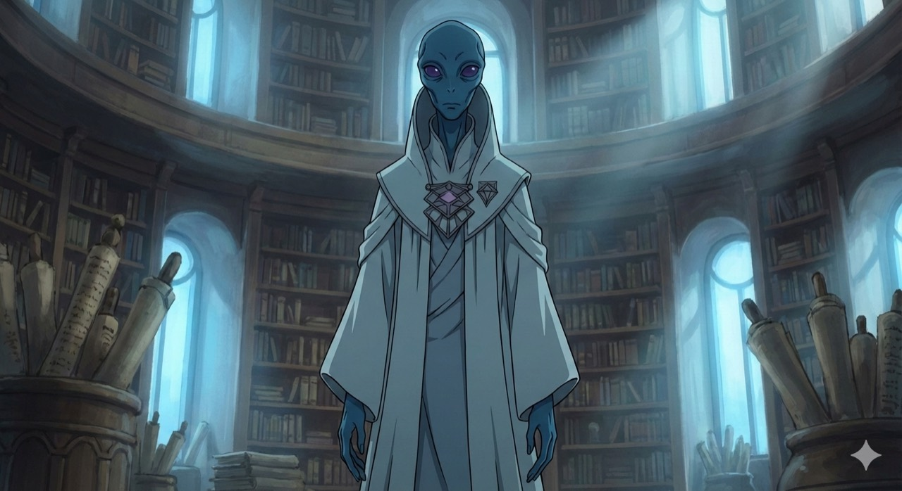
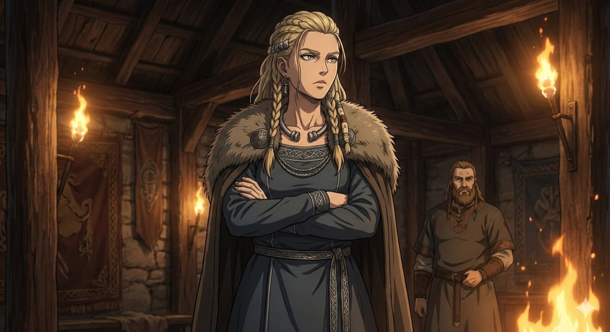
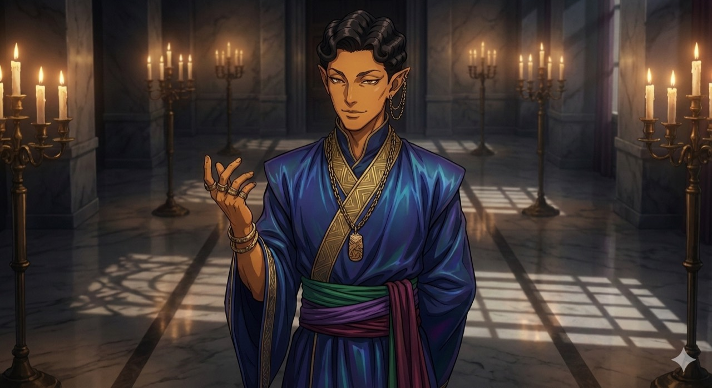
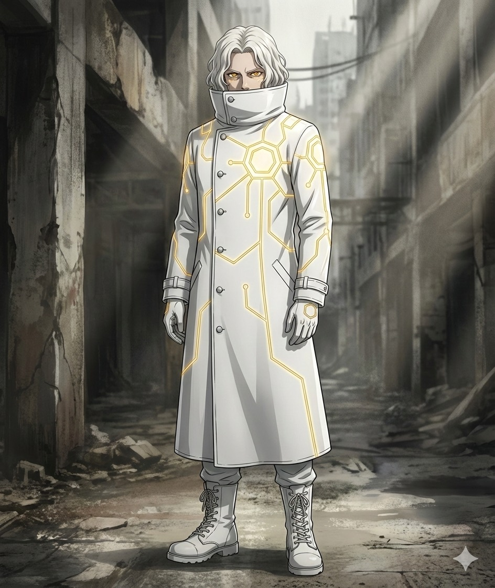

# Confirmed visual references

The user confirmed these labels on 4 October 2026. These illustrations are appearance references, not additional story events. The lore bible governs species biology; the tracker governs individual appearances and their changes. Protagonist is the public-edition character name.

| Supplied image | Confirmed subject | Visible reference details |
|---|---|---|
| 1 | Annunaki, ceremonial presentation | Pale silver-grey skin, white braided hair and beard, gold eyes, inscribed gold collar and shoulder pieces, deep blue drapery |
| 2 | Annunaki, armoured presentation | Pale blue-grey skin, long white hair and bound beard, gold armour and bracers, sword |
| 3 | Lyran | Copper-toned skin, pointed ears, reddish-brown hair, green clothing and dark red cloak |
| 4 | Lyran warrior | Dark hair, copper-toned skin, angular iridescent armour, damaged red cape, sword and enclosed helmet |
| 5 | Arcturian | Blue skin, elongated cranium, large violet eyes, slender body, white high-collared robes |
| 6 | Pleiadian | Fair skin, blonde braided hair, light eyes, dark clothing, fur-trimmed cloak |
| 7 | Sirian humanoid | Copper-gold skin, pointed ears, dark curled hair, blue-violet robes and gold jewellery; this does not represent every species holding Sirian citizenship |
| 8 | Protagonist, current appearance | White wavy hair, gold eyes, white high-collared long coat with gold circuitry, white gloves, trousers and lace-up boots |

**Nephilim clarification:** None of these images depicts a Nephilim. Their appearance is an Annunaki–human cross. Image 4 is specifically a Lyran warrior. The lore bible retains the distinction between original hybrids and the modified soldier caste.

## Protagonist current appearance

Image 8 is the definitive supplied visual reference for the changed appearance. The written tracker retains the stated 165 cm height, nanite construction, self-cleaning outfit, and energy-responsive gold pattern. The artwork’s polygonal circuitry is a visual rendition; it does not independently change the written heptagonal motif or establish a new scene, location, or power.

## Image 1: Annunaki Ceremonial

## Image 2: Annunaki Armoured

## Image 3: Lyran

## Image 4: Lyran Warrior

## Image 5: Arcturian

## Image 6: Pleiadian

## Image 7: Sirian

## Image 8: Protagonist Current

